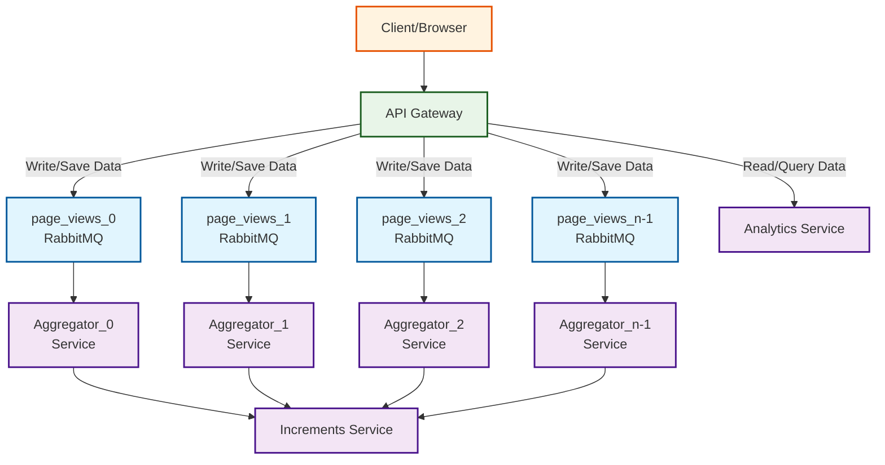

# Analytics Architecture Diagram

## Architecture Flow

### Write Flow (Data Ingestion)

1. **API Gateway**: Receives page view requests from clients and distributes them across N partitioned queues (`page_views_0` to `page_views_n-1`)
2. **Aggregator Services**: Each aggregator service (0 to n-1) reads from its respective partitioned queue and:
   - Processes up to 1000 messages OR waits 1 minute (whichever comes first)
   - Aggregates messages by pages
   - Writes aggregated data to the increments service

### Read Flow (Data Querying)

1. **API Gateway**: Receives query requests from clients and forwards them to the Analytics Service
2. **Analytics Service**: Processes queries and returns analytics data to clients

## Components

- **API Gateway**: Entry point for page view data
- **RabbitMQ Queues**:
  - `page_views`: Main queue for incoming data
  - `page_views_0` to `page_views_n-1`: Partitioned queues for parallel processing
- **Partitioner Service**: Distributes load across partitions
- **Aggregator Services**: Process and aggregate data in parallel
- **Increments Service**: Final destination for aggregated analytics data
